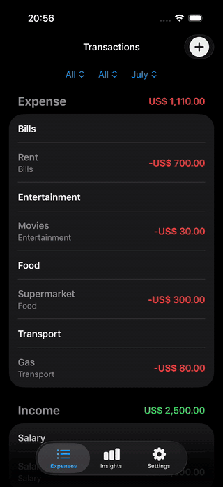
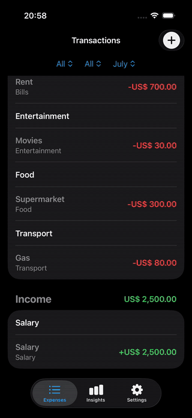

<div align="center">

# Respect Money

### A native iOS finance tracker built to make everyday spending visible.

[](https://www.swift.org/)
[](https://developer.apple.com/xcode/swiftui/)
[](https://developer.apple.com/documentation/swiftdata)
[](https://developer.apple.com/ios/)
[](LICENSE)

Track income and expenses, understand where money goes, and turn raw transactions into useful financial insights—all in a clean, native SwiftUI experience.

</div>

## App preview

<p align="center">
  
  
  
  
</p>

### See it in action

<table>
  <tr>
    <th width="50%">Browse and analyze transactions</th>
    <th width="50%">Add a new transaction</th>
  </tr>
  <tr>
    <td align="center"></td>
    <td align="center"></td>
  </tr>
  <tr>
    <td align="center"><a href="media/Screen%20Recording%20iPhone%2017%20Pro%2017-07-2026%20at%2020.57.11.mp4">Watch the full-quality video</a></td>
    <td align="center"><a href="media/Screen%20Recording%20iPhone%2017%20Pro%2017-07-2026%20at%2020.58.12.mp4">Watch the full-quality video</a></td>
  </tr>
</table>

## What it does

- **Transaction management** — create, edit, and delete income or expense entries.
- **Smart organization** — filter transactions by type, category, and month, then view them in grouped sections.
- **Actionable insights** — compare income, expenses, and net savings with Swift Charts.
- **Category breakdowns** — see expense totals and percentages across color-coded categories.
- **Flexible preferences** — choose from locale-supported currencies and manage custom income and expense categories.
- **Local-first storage** — persist financial data on-device with SwiftData; no account or network connection required.
- **Native experience** — built with NavigationStack, sheets, forms, pickers, SF Symbols, and system appearance support.
- **Safer destructive actions** — confirmation is required before deleting all stored data.

## Engineering highlights

Respect Money is deliberately built with Apple's modern frameworks and no third-party dependencies.

| Area | Implementation |
| --- | --- |
| UI | Declarative, reusable views with **SwiftUI** |
| Persistence | `@Model`, `ModelContainer`, `@Query`, and `ModelContext` with **SwiftData** |
| Data visualization | Responsive bar charts and annotations with **Swift Charts** |
| State | `@State`, `@Environment`, and `@AppStorage` for focused state ownership |
| Formatting | Locale-aware currency input, parsing, symbols, and display |
| Data modeling | Typed transaction model with UUID identity and income/expense semantics |
| Quality | Unit-test and UI-test targets, including launch and performance test scaffolding |
| Configuration | Build settings separated through `.xcconfig` |

## Architecture

The app follows a lightweight, feature-oriented SwiftUI structure. Views read and mutate the shared SwiftData container directly, while small computed properties transform transactions into presentation-ready groups, totals, and chart series.

```text
RespectMoneyApp
└── ModelContainer (SwiftData)
    └── MainTabView
        ├── TransactionListView
        │   ├── AddTransactionView
        │   └── EditTransactionView
        ├── TransactionChartView
        └── SettingsView
            ├── ExpenseCategoriesView
            └── IncomeCategoriesView
```

```text
RespectMoney/RespectMoney/Main
├── Common/       # Currency formatting and shared extensions
├── Model/        # SwiftData models
├── View/         # Feature screens and reusable view modifiers
└── RespectMoneyApp.swift
```

This approach keeps the project easy to navigate without introducing abstraction before it is needed. The edit flow also uses a separate draft model, so changing a field does not accidentally persist before the user taps **Save**.

## Getting started

### Requirements

- macOS with Xcode 16 or later
- iOS 17.6 or later
- No external packages or API keys

### Run locally

1. Clone the repository:

   ```bash
   git clone https://github.com/mduranx64/respect-money.git
   cd respect-money
   ```

2. Open the Xcode project:

   ```bash
   open RespectMoney/RespectMoney.xcodeproj
   ```

3. Select an iPhone simulator and press **Run** (`⌘R`).

SwiftData initializes the local store automatically. Default categories and the device's local currency are configured on first launch.

## Testing

Run the unit and UI test targets from Xcode with **Product → Test** (`⌘U`), or use the included `RespectMoney.xctestplan`.

The project includes targets for:

- Swift unit tests
- UI flow tests
- Launch screenshots
- App launch performance measurement

## Roadmap

- [ ] Expand unit and UI test coverage
- [ ] Add budgets and progress tracking
- [ ] Add recurring transactions
- [ ] Export and import transaction data
- [ ] Add richer time-range analytics
- [ ] Introduce accessibility and localization audits

## License

Respect Money is available under the [MIT License](LICENSE).

---

<div align="center">
Built with SwiftUI, SwiftData, and Swift Charts.
</div>
